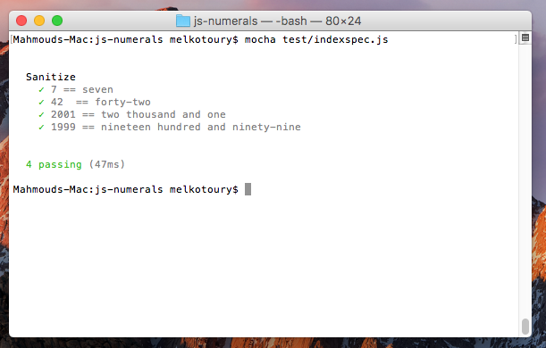

Digital Natives Job Excercises

# Codebase
* Vanilla Ecmascript 6

#Compatibility

* Internet Explorer : <span style="color:red">Fail</span> , use **[babel](https://babeljs.io/)** or **[traceur](https://github.com/google/traceur-compiler)** transpilers to compile _ES 6_ into _ES 5_ code
* Microsoft Edge    : <span style="color:green">Pass</span> 
* Google Chrome     : <span style="color:green">Pass</span>
* Mozilla Firefox   : <span style="color:green">Pass</span>

#Testing
* Mocha and Chai
* Don't use ~~mocha~~ as it's not compatible with _ES 6_ 
* Instead use **mocha-traceur** , work fine with _ES 6_
* e.g: you can do the following when testing:
```shell
mocha test/indexspec.js  --compilers js:mocha-traceur
```
#Testing Results
[]